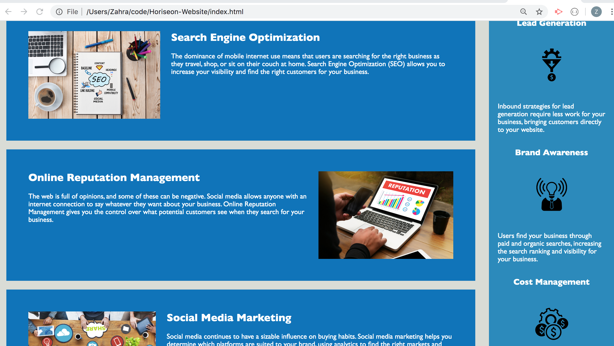

# Horiseon website 

## improve the index.html and style.css file 
This project was to improve the styling of the webpage in Horiseon and also it tried to clean the code in html file.

## Table of contents
* [Changes](#Changes)
* [Screenshots](#screenshots)
* [Setup](#setup)
* [Status](#status)
* [Usage](#Usage)
* [Todo](#Todo)
* [credits](#credits)
* [Contact](#contact)
* [license](#license)

#### Changes 

1) Change in title to have a more specific name.
2) The main photo was too large. adjusted the size and added margin to the bottom so that people will see some content with the first glance at the first page without scrolling down so much.
3) Delete Div around header and changed it to just header. Also, making the sematic html properties to more specific ones such as section and aside will help the code to be read easier.
4) img is self closing so no need for / just > is enough. Just to clean up the code.
5) Search-Engine-Optimization only had a class and that is why I added an ID.
6) cleaned the alignment of the code such as the way opening and closing commands are sorted
7) changed semantic html properties to more specific ones such as section and aside
8) gave class names to two groups of three, and made the .css file a bit shortened by soing so, (naming them by class name)
9) font change to the title of each box on the left so they appear on the same line.

#### Screen Shot

 

#### Setup
To use this app you can click : [here](file:///Users/Zahra/code/Horiseon-Website/index.html)

## Status
Project is:  _no longer continue_ because it is not supposed to be responsive for the purpose of this project.

#### Usage
This application is not responsive. 

#### Todo
* The html file can definitely improve by working on its arrangements. 
* The CSS file can still be shortened. 
* One problem with this website is that the contents get out of order when you shrink the page which can be fixed.
* replaced the rest of div tags with the proper semantic tag. 
* Used a section tag in some places, but it could also be used in lines 29 - 57.
* look into main and footer tags as well. 

#### credits
The HTML and CSS was provided by [Triology](https://www.trilogyed.com/)

#### Contact
Email: zahraaliaghazadeh@gmail.com

LinkedIn: [LinkedIn](https://www.linkedin.com/in/yalda-aghazade-7a9b0390)

#### Licence
MIT license
copy right ©Zahra Ali Aghazadeh